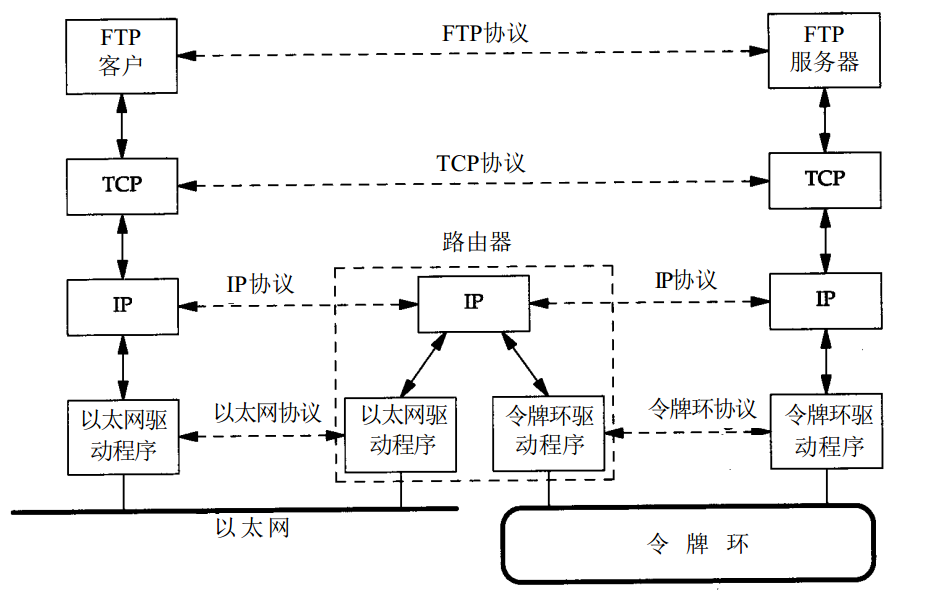
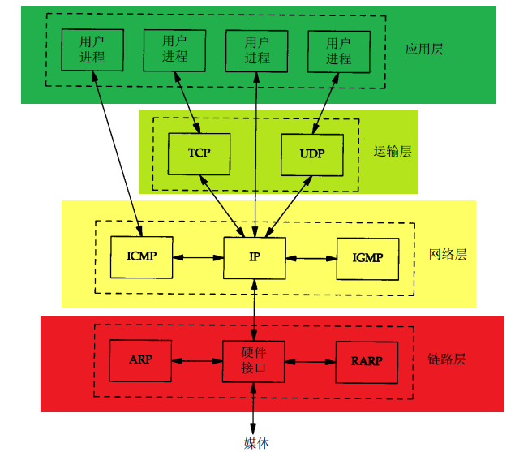
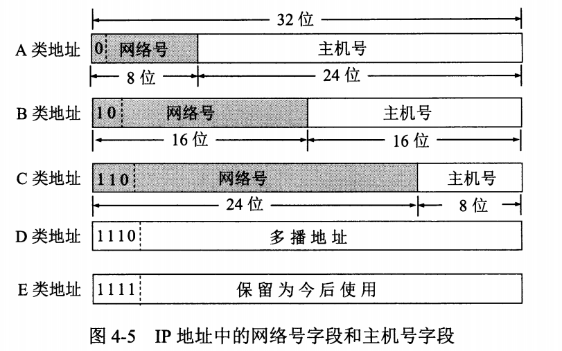
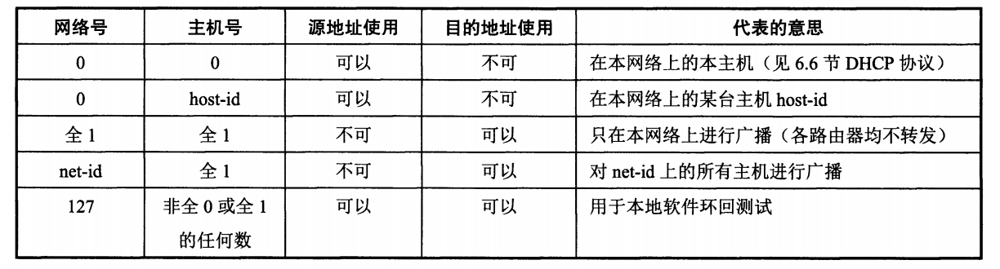

# 路由器
一个路由器具有两个或多个网络接口层（因为它连接了两个或多个网络）
大多数也允许一个多接口主机担当路由器的功能，但是主机为此必须进行特殊的配置。
路由器在网络层上对网络进行互连。

# 端系统和中间系统
应用层和传输层使用端到端协议（end-to-end)协议。
网络层提供的是逐跳协议（Hop-by-hop）协议。

# 互联网
在应用程序中隐藏所有的物理细节，不关心主机在以太网上还是令牌环网上。

# 网桥
网桥是在链路层对网络进行互连。网桥使得多个局域网（LAN）组合在一起，相对于上层来说好像是一个局域网。

# TCP/IP分层

 * 应用层  
 DNS、HTTP/S、TFTP（简单文件传输协议）、BOOTP（引导程序协议）、Socks5、SNMP、telnet
 * 传输层  
 TCP、UDP、SCTP
 * 网络层  
 ICMP（与其他主机或路由器交换错误报文和其他重要信息）、代表性工具：tracert、ping。   
 IGMP（Internet组管理协议，将UDP数据包多播到多个主机）。
 * 链路层
 ARP（地址解析协议）和RARP（逆地址解析协议）用来转换IP层（IP地址）和网络接口层（MAC地址）之间的转换。
 
# 互联网地址
　
* 特殊地址  
a) **IP地址**全0表示”这个(this)“；   
b) **网络号**字段为全0的IP地址是个保留地址，意思为“本网络”；  
c) **网络号**为127(01111111)保留作为本地回环地址；
d) **主机号**为全0，表示该ip地址是“本主机”所连接到的网络地址，即网段。   
e) **主机号**为全1，表示该网络上的所有主机，即广播地址。  
f) **128.0.0.0**网络地址不指派。   
g) **192.0.0.0**网络地址不指派。  
　  
* A类可分配的地址：(2^7-2) * (2^24-2); 1.0.0.1 ~ 126.255.255.254   
* B类可分配的地址：(2^14-1) * (2^16-2); 128.1.0.1 ~ 191.255.255.254
* C类可分配地址：(2^21-1) * (2^8-2); 192.0.1.1 ~ 223.255.255.254

# 客户-服务器模型
这种服务主要分为两种：重复型或并发性。  
1. 重复性  
* 等待一个客户的请求
* 处理客户请求
* 发送响应给客户
* 循环上述过程
2. 并发性  
* 等待一个客户的到来
* 启动新服务来处理这个客户请求，在这期间可能产生新进程/线程、并依赖底层操作系统支持。生成的新服务器对客户全部请求进行处理。处理接收，终止服务。
* 循环上述过程  
>一般说来，TCP服务器是并发的，而UDP服务器是重复的

# 端口号
`1~1023`            系统端口号   
`1024~49151`        登记端口号   
`49152~65535`       客户端使用的端口号  

# 标准服务
|名字|TCP端口|UDP端口|RFC|描述|
|:-:|:-:|:-:|:-:|:-|
|echo|7|7|862|服务器返回客户端的所有内容|
|discard|9|9|863|服务器丢弃客户发送的所有内容|
|daytime|13|13|867|服务器以可读形式返回时间和日期|
|chargen|19|19|864|当客户发送一个数据报时，TCP服务器发送一串连续的字符流，直到客户中断连接。UDP服务器发送一个随机长度的数据报|
|time|37|37|868|服务器返回一个二进制32bit数，表示UTC时间1900年1月1日午夜至今的秒数|

因为历史原因，这些端口号都是奇数（都是从NCP网络控制协议派生出来的，这是ARPANET的运输层协议，TCP前身，NCP并且是单工的，所以每个程序需要有两个链接，预留一对奇数和偶数端口号）。
