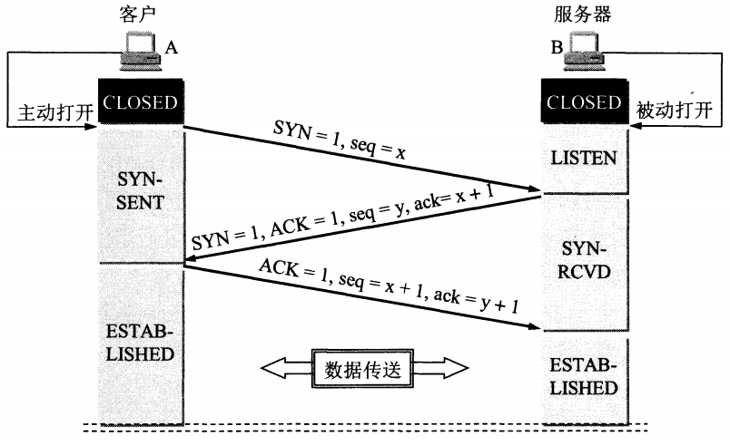
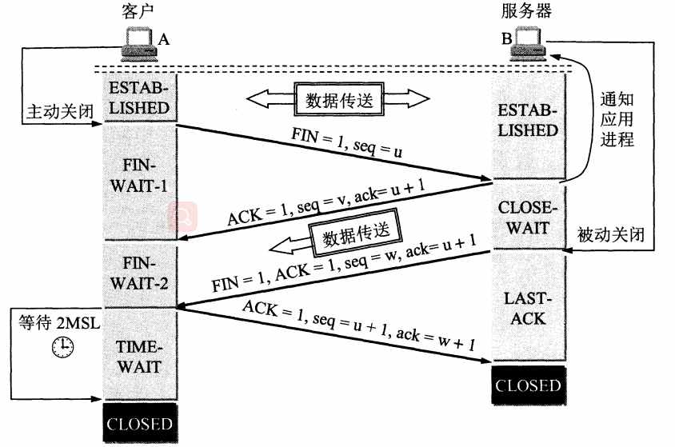
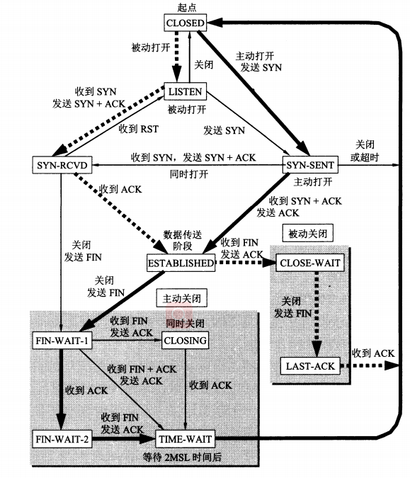

# TCP连接的建立与终止

# TCPDUMP命令行输出
  
 1~3为tcp连接建立， 4~7位连接断开。

 |标志|3字符缩写|描述|
 |:-:|:-:|:-:|
 |S|SYN|同步序号|
 |F|FIN|发送方完成数据发送|
 |R|RST|复位连接|
 |P|PSH|尽可能快的将数据发往接收进程|
 |.||以上4个标志均置零

# TCP建立连接协议
* 请求段（客户端）发送一个SYN端指明客户打算连接的服务器端口，以及出事序号（ISN：1415531521）。
* 服务器发回包含服务器的初始序号（ISN:18230521)作为应答，同时将确认序号设置为客户端的ISN加1以对客户端的SYN报文段进行确认。
* 客户必须将确认序号设置为服务器的ISN加1以对服务器的SYN报文段进行确认。    

 1.  一开始，B的TCP服务器进程先创建传输控制块`TCB`，准备接受客户进程的连接请求。然后服务器进程就处于`LISTEN`（监听）状态，等待客户的连接请求。
 2. A的TCP客户进程也是首先创建传输控制模块TCB。在打算建立TCP连接时，向B发出连接请求报文段，这是首部中同步位`SYN = 1`,同时选择一个初始序号`seq = x`。TCP规定，SYN报文段（即`SYN=1`的报文段）不能携带数据，但要消耗一个序号。这时客户进程进入`SYN_SENT`(同步已发送)状态。
 3. B收到连接请求报文段后，如同意建立连接，则向A发送确认。在确认报文段应把SYN位和ACK位都置为1，确认号是ack=x+1,同时也为自己选择一个初始序号`seq=y`。请注意，这个报文段也不能携带数据，但同样要消耗一个序号。这时TCP服务器进程进入`SYN-RCVD`(同步收到)状态。
 4. TCP客户进程收到B的确认后，还要向B给出确认。确认报文段的ACK置1，确认号`ack=y+1`,而自己的序号`seq=x+1`。TCP的标准规定，ACK报文段可以携带数据。但如果不携带数据则不消耗序号，在这种情况下，下一个数据报文段的序号仍是`seq=x+1`。这时TCP连接已经建立，A进入`ESTABLISHED`（已建立连接）状态。
 5. 当B收到A的确认后，也进入`ESTABLISHED`状态。

 # 为什么客户端为什么最后还需要发送一次确认呢？
 这主要是为了防止已失效的连接请求报文段突然又传送到了B，因而产生错误。
A发出连接请求，在某些网络节点上长时间滞留，以致延误到连接释放以后才到达B。这个报文段已经失效，但B收到此失效的报文段后，就误认为是A发出了新的连接请求，于是向A发出，确认报文段，同意建立连接。但A之前的请求已经过期，这个时候收到B建立连接的请求，不会理睬B的确认，也不会向B发送数据了。为了区别正常情况和异常情况，正常情况就发，异常情况就不发了。

# TCP连接释放   
1. 客户端主动释放连接：数据传输结束后，通信的双方都可释放连接。现在A和B都处于`ESTABLISHED`状态。A的应用程序先向其TCP发出释放报文段，并停止发送数据，主动关闭TCP连接。A把连接释放报文段首部的终止控制为`FIN`置1，其序号`seq=u`,它等于前面已经传送过的数据的最后一个字节加1。这是A进入`FIN-WAIT-1`(终止等待1)状态,等待B的确认。注意TCP规定，FIN报文段即使不携带数据，它也消耗掉一个序号。   
2. 服务端半关闭： B收到连接释放报文段后即发出确认，确认号是`ack=u+1`,而这个报文段自己的序号是`v`,等于B前面已传送过的数据的最后一个字节加1。然后B进入`CLOSE_WAIT`(关闭等待)状态。TCP服务进程这时应通知高层应用进程，A到B的连接释放了，这时TCP连接处于`半关闭`状态，即A停止数据发送，但B若发送数据，A仍要接收，B到A的连接并未关闭，这个状态可能会持续一段时间。
3. A收到B的确认后，就进入`FIN_WAIT_2`(终止等待2)状态,等待B的连接释放报文段。
4. 若B已经没有要向A发送的数据，其应用进程就通知TCP释放连接。这时B发出的连接释放报文段必须使`FIN = 1`。现假定B的序号为`w`（在半关闭时B又可能发送了一些数据）。B还必须重复上次已发送的确认号`ack=u+1`。这时B就进入了LAST-ACK(最后确认)状态，等待A的确认。
5. A在收到B的连接释放报文段后，必须对此发出确认。在确认报文段中`ACK`置`1`，确认号为`ack=W+1`,而自己的序号是`seq=u+1`。然后进入到TIME_WAIT(时间等待)状态。 请注意，现在的连接还没有释放掉。必须经过时间等待计时器（TIME_WAIT)设置的2MSL后，A才能进入到CLOSED状态。时间MSL叫做最长报文段寿命（Maximum Segment Lifetime）， RFC793建议为2分钟。因此A进入TIME_WAIT后，要经过4分钟才能进入到CLOSED状态，才能开始一个新的连接。当A撤销相应传输控制块TCB后，就结束了这次的TCP连接。
6. B收到A发出的确认，进入`CLOSED`状态。同样此时B撤销传输控制块TCP，结束本次连接。
   
 对于现在的网络MSL=2分钟可能太长了一些。因此TCP允许不同的实现可根据具体情况使用更小的MSL值。
 B结束连接的时间要比A早一些。

# 为什么A在TIME_WAIT状态等待2MSL的时间呢？
1. 保证A发送的最后一个ACK报文段能够到达B。这个ACK报文段有可能丢失，因为使处在`LAST_ACK`状态的B收不到对已发送的`FIN+ACK`报文段的确认。B会超时重传这个`FIN+ACK`报文段，而A就能在2MSL时间内收到这个重传的`FIN+ACK`报文段。接着A重传一次确认，重新启动2MSL计时器。最后，A和B都正常进入`CLOSED`状态。如果A在`TIME_WAIT`状态不等待一段时间，而是在发送完ACK报文段后立即释放连接，那么就无法收到B重传的`FIN+ACK`报文段，因而也不会再发送一次确认报文段。这样，B就无法按照正常步骤进入 `CLOSED`状态。
2. 防止"已失效的连接请求报文段"出现，A发送完最后一个ACK报文段后，再经过2MSL，就可以本链接所产生的报文段都从网络中消失。这样就可以使下一个新的连中不会出现这种旧的连接请求报文段。

# 保活计时器(keepalive timer)
除时间等待计时器以外，TCP还设有一个保活计时器。主要是为了防止这种情况：客户已经主动与服务器建立了TCP连接。但后来客户端的主机突然故障。此时，服务器就不能再收到客户发来的数据。因此，应当有措施使服务器不要白白等待下去。这就有了保活计时器。服务器没收到一次客户数据，就重新设置保活计时器，时间的设置通常是两个小时。若两个小时没有收到客户的数据，服务器就发送一个探测报文段，以后则每隔75秒发送一次。若一连发送10个探测报文段后仍无客户的响应，服务器就认为客户端除了故障，接着就关闭这个连接。

# 个人理解保活计时器跟程序的心跳之前的区别
保活计时器是TCP协议实现的，程序心跳是代码实现的，保活计时器只能保证物理链路的顺畅，而不能保证程序的问题。

# TCP有限状态机  
* *粗实线*表示客户进程的正常变化    
* *粗虚箭头*表示服务器的正常变化  
* *细线箭头*表示异常变迁  
   