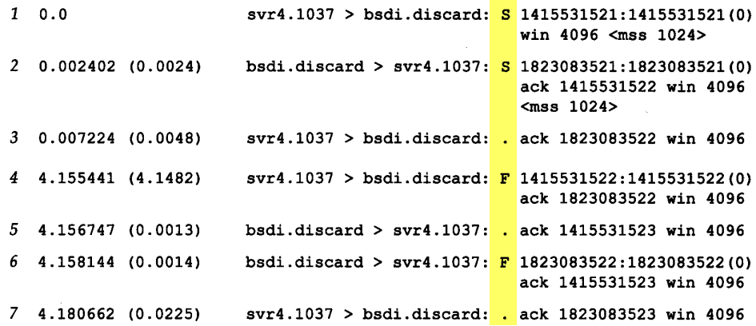

# TCP连接的建立与终止

# TCPDUMP命令行输出

 1~3为tcp连接建立， 4~7位连接断开，这是最完美的一种结束方式了。

 |标志|3字符缩写|描述|
 |:-:|:-:|:-:|
 |S|SYN|同步序号|
 |F|FIN|发送方完成数据发送|
 |R|RST|复位连接|
 |P|PSH|尽可能快的将数据发往接收进程|
 |.||以上4个标志均置零

# TCP建立连接协议
* 请求段（客户端）发送一个SYN端指明客户打算连接的服务器端口，以及出事序号（ISN：1415531521）。
* 服务器发回包含服务器的初始序号（ISN:18230521)作为应答，同时将确认序号设置为客户端的ISN加1以对客户端的SYN报文段进行确认。
* 客户必须将确认序号设置为服务器的ISN加1以对服务器的SYN报文段进行确认。    

 1.  一开始，B的TCP服务器进程先创建传输控制块`TCB`，准备接受客户进程的连接请求。然后服务器进程就处于`LISTEN`（监听）状态，等待客户的连接请求。
 2. A的TCP客户进程也是首先创建传输控制模块TCB。在打算建立TCP连接时，向B发出连接请求报文段，这是首部中同步位`SYN = 1`,同时选择一个初始序号`seq = x`。TCP规定，SYN报文段（即`SYN=1`的报文段）不能携带数据，但要消耗一个序号。这时客户进程进入`SYN_SENT`(同步已发送)状态。
 3. B收到连接请求报文段后，如同意建立连接，则向A发送确认。在确认报文段应把SYN位和ACK位都置为1，确认号是ack=x+1,同时也为自己选择一个初始序号`seq=y`。请注意，这个报文段也不能携带数据，但同样要消耗一个序号。这时TCP服务器进程进入`SYN-RCVD`(同步收到)状态。
 4. TCP客户进程收到B的确认后，还要向B给出确认。确认报文段的ACK置1，确认号`ack=y+1`,而自己的序号`seq=x+1`。TCP的标准规定，ACK报文段可以携带数据。但如果不携带数据则不消耗序号，在这种情况下，下一个数据报文段的序号仍是`seq=x+1`。这时TCP连接已经建立，A进入`ESTABLISHED`（已建立连接）状态。
 5. 当B收到A的确认后，也进入`ESTABLISHED`状态。

 # 为什么客户端为什么最后还需要发送一次确认呢？
 这主要是为了防止已失效的连接请求报文段突然又传送到了B，因而产生错误。
 正常情况下，A发出连接请求，在某些网络节点上长时间滞留，以致延误到连接释放以后才到达B。这个报文段已经失效，但B收到此失效的报文段后